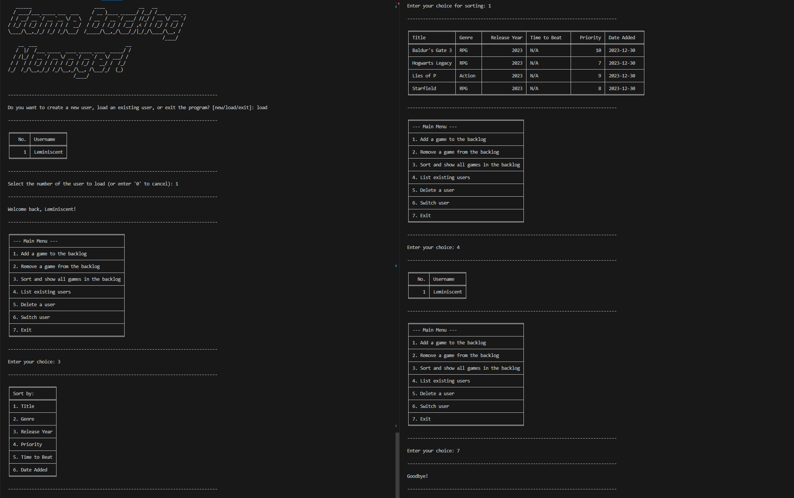

# Game Backlog Manager

**Author**: Lemuel Nogueira

The Game Backlog Manager is a comprehensive Python application designed for gamers to manage their backlog of video games effectively. With user-friendly functionalities to add, remove, sort, and display games, this tool simplifies backlog management. It also offers robust user profile management, allowing for a tailored experience.

## Key Features

- **User Management**: Efficiently create, load, and switch between user profiles.
- **Backlog Handling**: Add games to your backlog with detailed attributes like title, genre, release year, etc. Remove games as needed.
- **Advanced Game Sorting**: Sort your games based on various attributes such as title, genre, or release year for easier management.
- **Persistent Data Storage**: Your game backlog is saved in files, ensuring that your data is preserved between application sessions.

## Core Classes

- `Game`: Models a video game with comprehensive attributes including title, genre, release year, date of addition to the backlog, estimated completion time, and priority.
- `Backlog`: A robust manager for a user's game collection, with capabilities to add, remove, sort games, and handle file-based data storage and retrieval.
- `User`: Represents an application user, managing their personalized game backlog.

## Exception Handling

- `ValidationError`: A generic exception class for various validation errors.
- `InvalidGameDataError`: Triggered by inconsistencies or errors in the structure or content of game data.
- `FileIOError`: Handles errors related to file input/output operations, ensuring data integrity.
- `InvalidDateError`: Catches errors related to improper date formats or values.
- `DuplicateUsernameError`: Alerts when there's an attempt to create a user with a duplicate username.

## Main Application Flow

The `main()` function serves as the gateway to the application, offering a user-friendly, menu-driven interface. It enables users to engage with various aspects of the app, such as managing user profiles and their game backlog. The application operates in a loop, providing continuous access to its features.

## Getting Started

To engage with the Game Backlog Manager:

1. **Launch the Application**: Start the app to access the main menu.
2. **User Profile Options**: Choose to either create a new user profile, load an existing one, or exit.
3. **Backlog Management**: Once logged in, you'll have several options:
    - Add new games to your backlog.
    - Remove games from your backlog.
    - Sort and view all games in your backlog.
    - Manage users - list, delete, or switch between user profiles.
4. **Continuous Access**: The app remains operational until you opt to exit.

## Updates and Enhancements

- **Automated Game Data Retrieval**: Integration with the IGDB API is planned, enabling automatic filling of game data.
- **Graphical User Interface**: A Flask-based GUI is in development to provide an even more intuitive and visually appealing user experience.
